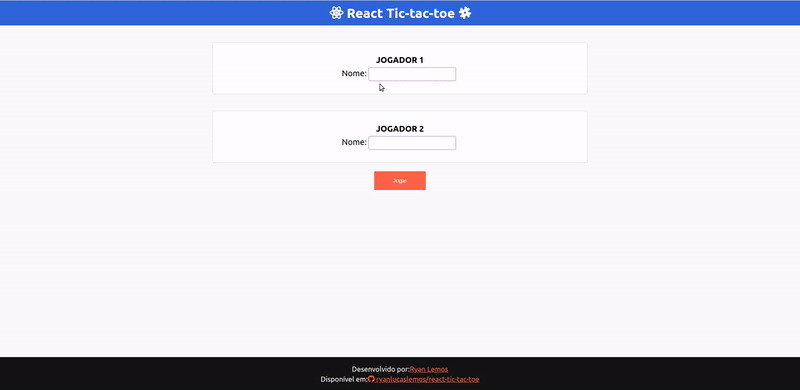
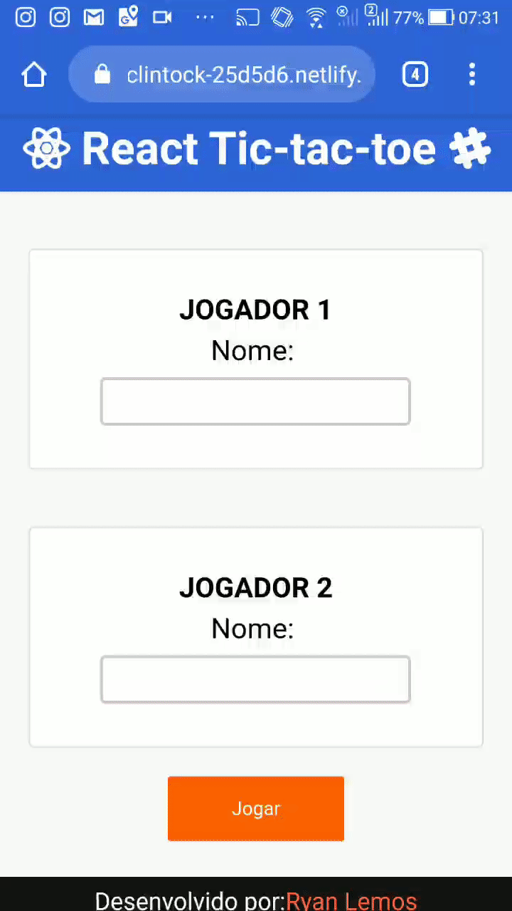

# Jogo da velha React

Uma simples implementação do jogo da velha, utilizando somente React e FontAwesome para os ícones.


### [Demo](https://elated-mcclintock-25d5d6.netlify.com/)

# Índice
  - [Print versão web/desktop:](#print-vers%c3%a3o-webdesktop)
  - [Print versão web/mobile:](#print-vers%c3%a3o-webmobile)
  - [Execução da aplicação](#execu%c3%a7%c3%a3o-da-aplica%c3%a7%c3%a3o)
  - [Modelagem do Jogo:](#modelagem-do-jogo)
    - [Verificação de vitórias](#verifica%c3%a7%c3%a3o-de-vit%c3%b3rias)
    - [Verificação de Empates (velha)](#verifica%c3%a7%c3%a3o-de-empates-velha)

***

## Print versão web/desktop:




## Print versão web/mobile:


***

## Execução da aplicação
O primeiro comando serve para baixar as dependências do projeto e o segundo para executar o projeto no browser.

Utilizando o __yarn__, execute:

```
yarn
yarn start
```

Utilizando o __npm__, execute:

```
npm install
npm run start
```

## Modelagem do Jogo:

Uma __matriz 3x3 de zeros__ é criada no início do jogo. Cada __posição da matriz__ representa uma __celula__ do tabuleiro. O jogador __1__ recebe o valor __1__, e o __jogador 2__ recebe o valor __-1__.


__OBS:__ Esses valores podem ser substituídos através da das posições __PLAY_VALUE__ de cada jogador da constante __GAME_MODEL__ presente em __game.model.js__.

Assim, ao clicar em uma célula verifica-se qual é o jogador atual, salva o __valor (1 ou -1)__ da sua jogada em sua determinada posição da __matriz de jogadas__. Feito isso busca-se a classe CSS da marcação do jogador atual, presente na constante __GAME_MODEL__ e substitui a classe da tag __i__ da celula.

Ao modificar a matriz, o estado muda, renderizando assim o tabuleiro com as novas jogadas.


### Verificação de vitórias

A verificação de vitórias é simples, verifica-se a matriz na horizontal, vertical e diagonal, somando-se os valores salvos nas posições.

Por exemplo o seguinte tabuleiro:

|   X   |       |   O   |
| :---: | :---: | :---: |
|   O   |   X   |   O   |
|   X   |       |   X   |

Que pode ser convertido em:

|   1   |   0   |  -1   |
| :---: | :---: | :---: |
|  -1   |   1   |  -1   |
|   1   |   0   |   1   |

Ao somar a diagonal vencendora tem-se o valor __3__. O que é feito então, é percorrer a matriz, gerando a soma de cada linha, coluna e diagonal. Essas somas são salvas em uma __matriz de resultados__. Posteriormente, verifica se alguma dessas somas é __3__ ou __-3__ (valores vencedores).

### Verificação de Empates (velha)

O jogo conta, a rodada atual. A cada jogada o valor do contador de rodadas aumenta. Sendo uma matriz 3x3 é possível então realizar __9 jogadas__. A partir da __rodada 7__ é possível inferir se o jogo finalizará em empate.

__Pergunta__: E como fazer isso?

__Resposta__: Simples, para que haja uma chance de vitória, ao menos um valor __2__ ou __-2__ deve existir nesse ponto. Então deve-se percorrer a matriz de resultados e verificar se há algum desses valores. Senão encontrar nenhum significa que nenhum dos dois jogadores conseguirá vencer.
Porém há o caso em que o jogador consegue a pontuação (2 ou -2) porém mesmo assim será velha. Por exemplo (quando o jogador 1 assume o x e o 2 assume o O):

|   X   |   O   |   X   |
| :---: | :---: | :---: |
|   X   |   O   |   O   |
|   O   |       |   X   |

Que pode ser convertido em:

|   1   |  -1   |   1   |
| :---: | :---: | :---: |
|   1   |  -1   |  -1   |
|  -1   |   0   |   1   |

Ao somar a segunda coluna, o resultado dá um dos valores em que é possível a vitória, porém, como só resta uma jogada, do outro jogador o jogo termina em empate. O algoritmo prediz o empate antes do preenchimento de todas as posições. Então se for a última rodada, e restar somente uma posição, o algoritmo descarta a chance do segundo jogador de ganhar.
